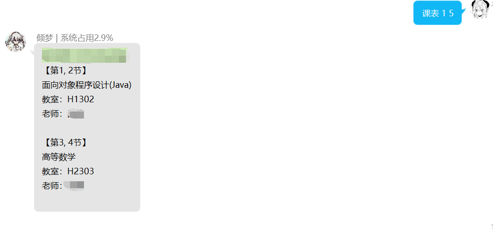

# cuit_schedule_management
成都信息工程大学课表管理

### 获取课表数据
可通过html处理（后续考虑更新）
或手填(不是很多，填一次用一学期)

形如:
```json
{
    "Mon":[
        {
            "name":"网络空间安全导论",
            "teacher":"卢嘉中",
            "week":[11,18,1],
            "room":"H4402",
            "time":[1,2]
        },
        {
            "name":"面向对象程序设计(Java)",
            "teacher":"昌燕",
            "week":[1,8,1],
            "room":"H1302",
            "time":[3,4]
        },
        {
            "name":"离散数学",
            "teacher":"李汶珊",
            "week":[1,12,1],
            "room":"H1405",
            "time":[5,6]
        },
        {
            "name":"中国近代史纲要",
            "teacher":"李蓉",
            "week":[1,17,1],
            "room":"H1604",
            "time":[7,8]
        }
        ],
    "Tus":[
        {
            "name":"高等数学",
            "teacher":"胡燕",
            "week":[1,16,1],
            "room":"H2303",
            "time":[1,2]
        },
        {
            "name":"大学英语2",
            "teacher":"唐艳",
            "week":[1,16,1],
            "room":"H4305,H4310",
            "time":[3,4]
        },
        {
            "name":"创新创业教育基础",
            "teacher":"宋海权",
            "week":[11,16,1],
            "room":"H2304",
            "time":[5,6]
        },
        {
            "name":"中国近代史纲要",
            "teacher":"李蓉",
            "week":[1,5,1],
            "room":"H1604",
            "time":[5,6]
        },
        {
            "name":"大学物理B",
            "teacher":"胡云",
            "week":[1,13,1],
            "room":"H4203",
            "time":[7,8]
        }
    ],
    "Wed":[
        {
            "name":"离散数学",
            "teacher":"李汶珊",
            "week":[1,12,1],
            "room":"H1405",
            "time":[1,2]
        },
        {
            "name":"形势与政策II",
            "teacher":"余恬婧",
            "week":[15,16,1],
            "room":"H2201",
            "time":[3,4]
        },
        {
            "name":"国产化操作系统配置与使用",
            "teacher":"丁哲",
            "week":[11,14,1],
            "room":"H2201",
            "time":[3,4]
        },
        {
            "name":"体育2",
            "teacher":"选课",
            "week":[1,16,1],
            "room":"选课",
            "time":[5,6]
        }
    ],
    "Thu":[
        {
            "name":"大学物理B",
            "teacher":"胡云",
            "week":[1,13,1],
            "room":"H2305",
            "time":[1,2]
        },
        {
            "name":"高等数学",
            "teacher":"胡燕",
            "week":[1,16,1],
            "room":"H2303",
            "time":[3,4]
        }
    ],
    "Fri":[
        {
            "name":"面向对象程序设计(Java)",
            "teacher":"昌燕",
            "week":[1,8,1],
            "room":"H1302",
            "time":[1,2]
        },
        {
            "name":"国产化操作系统配置与使用",
            "teacher":"丁哲",
            "week":[11,14,1],
            "room":"H2201",
            "time":[3,4]
        },
        {
            "name":"高等数学",
            "teacher":"胡燕",
            "week":[1,4,1],
            "room":"H2303",
            "time":[3,4]
        },
        {
            "name":"大学英语2(双周)",
            "teacher":"唐艳",
            "week":[2,16,2],
            "room":"H4211",
            "time":[5,6]
        }
    ],
    "Sat":[],
    "Sun":[]
}
```
说明:
+ week列表为```[开始周次, 结束周次, 间隔时间]```
+ time列表为```[上课时间, 下课时间]```

### 配置
在```setting.py```中配置项目根目录

### 用例
